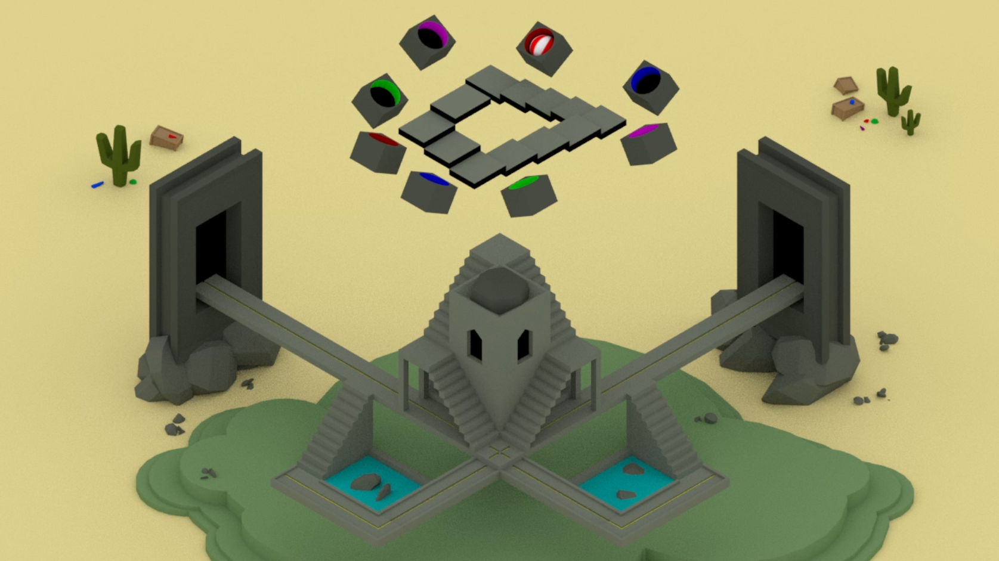

# Bouncing Ball
*Josh Bailey* 
*CGI Tools - Maya.* 
*NCCA, Bournemouth University.* 
*2020 - 2021.* 

## Contents
- [Bouncing Ball](#bouncing-ball)
  - [Contents](#contents)
  - [Overview](#overview)

## Overview
A key frame animation of a bouncing ball interacting with an impossible staircase. Scene inspired by the works of <i>M. C. Escher</i>, <i>Bucwah</i> and <i>Monument Valley</i>.

